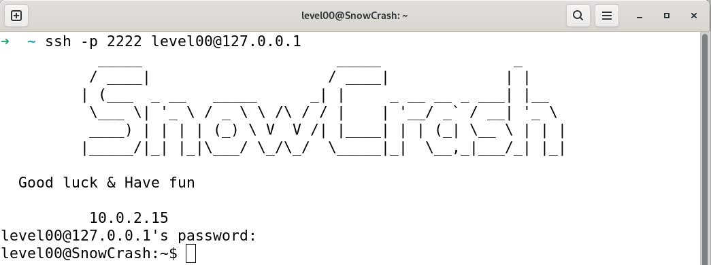

# Snowcrash

Snow Crash is a developer-oriented cybersecurity exercise at 42: you explore a VM with progressively advanced levels, uncover vulnerabilities (buffer overflows, shell exploits, mis-configurations), and document flags and techniques.<br>
This repo contains my write-ups and reflections on the exploit challenges.

## Snowcrash VM Setup Guide

### Goal

Download the Snowcrash ISO, create a VirtualBox VM, attach the ISO, and configure a bridged network so the VM and your host appear on the same LAN (same subnet) and can reach each other directly.

To download SnowCrash iso: https://cdn.intra.42.fr/isos/SnowCrash.iso

### VM Prerequisites (VirtualBox)

| Parameter | Value |
|-----------|-------|
| Processors | 4 |
| Base Memory | 2048 MB |
| Hard Disk Size | 25.00 GB |

### Configuring a NAT Network with Port Forwarding (VirtualBox)

#### Configuration Steps

1. **Open VirtualBox → Settings** (for your VM) → **Network**
2. **Adapter 1** → Enable Network Adapter
   - **Attached to:** NAT
3. Click **Advanced** → **Port Forwarding**
4. Add the following rule:
> [!TIP]
> My 4242 port was taken by another service, so I changed it with port 2222

| Name | Protocol | Host IP | Host Port | Guest IP | Guest Port |
|------|----------|---------|-----------|----------|------------|
| SSH  | TCP      | *(empty)* | 2222    | *(empty)* | 4242      |

5. Click **OK → OK**
6. Start the VM

> [!TIP]
> Make sure your **Host Port** (2222) is not already in use on your local machine.
> To check, run the following from your local terminal:
> ```bash
> ssh -vvv -p 2222 level00@127.0.0.1
> ```
> If you see `Error code: 400` in the output, the port is occupied by another process — choose a different Host Port (e.g., 2223, 2224) and update the rule accordingly.

#### Connecting to the VM

Once the VM is running, open a terminal on your local machine and run:
```bash
ssh -p 2222 level00@127.0.0.1
```

You should see:
```
level00@127.0.0.1's password:
```
Enter `level00` as the password (it won't be displayed — this is normal).

<p align="center">
  
</p>

## Tools I used:

## Ressources I checked:
- [OverTheWire.org](https://overthewire.org/wargames/bandit)
- [pwnable_writeup](https://research.checkpoint.com/wp-content/uploads/2020/03/pwnable_writeup.pdf)
- [ctf101.org](https://ctf101.org)
- [dencode.com](https://dencode.com/en/)
- [book.jorianwoltjer.com](https://book.jorianwoltjer.com)
