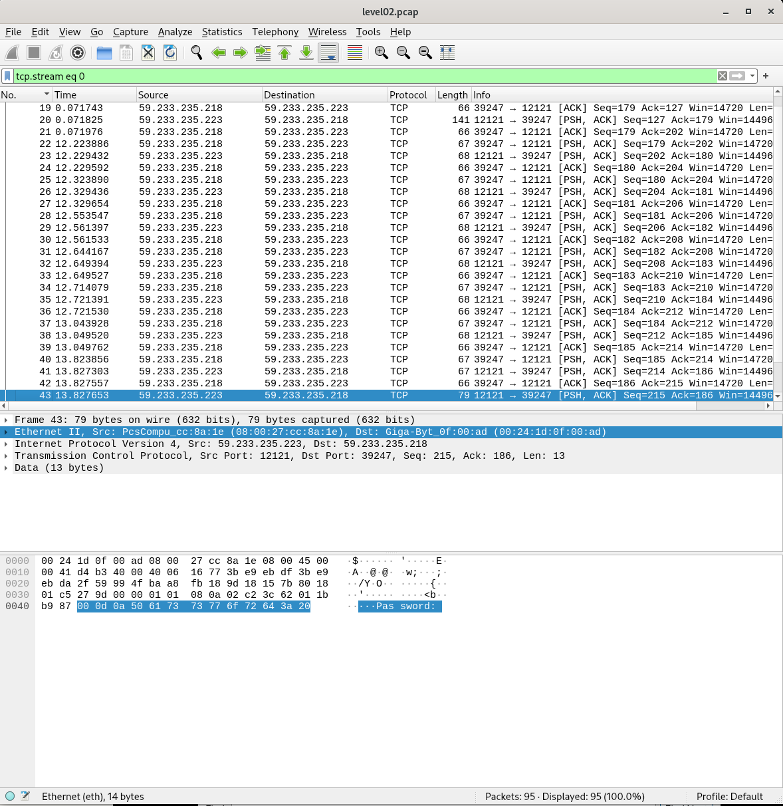
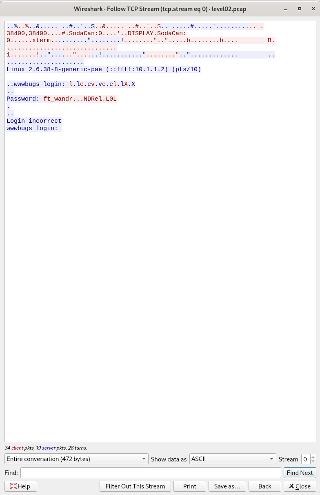
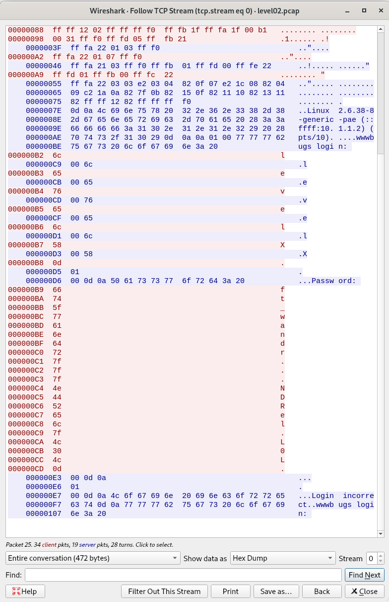

# SnowCrash — Level02 Walkthrough

## Overview

This level requires analyzing a network capture file (`level02.pcap`) using Wireshark to extract credentials sent over a Telnet session in plaintext.

---

## Prerequisites

- Wireshark installed on your local machine
- SSH access to the VM with port forwarding configured
- The `level02.pcap` file located on the VM at `/home/user/level02/level02.pcap`

---

## Step 1 — Copy the `.pcap` file from the VM to your local machine

Since the file is on a remote VM accessible via SSH with NAT port forwarding, use `scp` from your **local machine**:

```bash
scp -P 2222 level02@127.0.0.1:/home/user/level02/level02.pcap ~/Desktop/level02.pcap
```

> **Note:** `-P 2222` is the forwarded port on the host that redirects to port `4242` (or `22`) on the VM.  
> Replace `2222` with the port you configured in VirtualBox Port Forwarding.

---

## Step 2 — Open the file in Wireshark

```bash
wireshark ~/Desktop/level02.pcap
```

Wireshark will display a list of all captured packets with the following columns:

| Column      | Description                          |
|-------------|--------------------------------------|
| No.         | Packet number                        |
| Time        | Timestamp relative to first packet   |
| Source      | Sender IP address                    |
| Destination | Receiver IP address                  |
| Protocol    | Network protocol used (TCP, UDP...)  |
| Length      | Packet size in bytes                 |
| Info        | Summary of packet content            |



---

## Step 3 — Understand the TCP protocol

**TCP (Transmission Control Protocol)** is a reliable communication protocol between two machines. It ensures data arrives in the correct order without loss.

Key TCP flags visible in Wireshark:

| Flag  | Meaning                        |
|-------|--------------------------------|
| SYN   | Initiate a connection          |
| ACK   | Acknowledge received data      |
| PSH   | Push data immediately          |
| FIN   | Close the connection           |

In this capture, the traffic uses **Telnet on port 12121** — everything is transmitted in **plaintext**, including the login and password.

---

## Step 4 — Follow the TCP Stream

This is the key step to reconstruct the full conversation:

1. **Right-click** on any packet in the list
2. Click **Follow** → **TCP Stream**
3. A new window opens showing the entire session:
   - **Red text** = data sent by the client (login + password typed by the user)
   - **Blue text** = data sent by the server (prompts, responses)

You will see the server prompting:
```
wwwbugs login:
Password:
Login incorrect
```



---

## Step 5 — Read the raw hexadecimal data

Since the password is typed **character by character** over Telnet, each packet contains exactly **1 byte** of payload. To see the raw hex values:

1. In the **Follow TCP Stream** window, change **"Show data as"** from `ASCII` to `Hex Dump` (bottom dropdown)
2. The view now shows each byte with its offset and ASCII equivalent

```
Left column   → offset (position in bytes)
Middle column → hexadecimal values
Right column  → ASCII representation
```



> **Important:** Some bytes are not printable ASCII characters.  
> In particular, `0x7f` is the **DEL/Backspace** key — meaning the user deleted a character while typing.

---

## Step 6 — Reconstruct the password

By reading the hex values of packets sent **from the client to the server** after the `Password:` prompt, extract each character:

| Hex  | ASCII | Note               |
|------|-------|--------------------|
| 0x66 | f     |                    |
| 0x74 | t     |                    |
| 0x5f | _     |                    |
| 0x77 | w     |                    |
| 0x61 | a     |                    |
| 0x4e | N     |                    |
| 0x44 | D     |                    |
| 0x52 | R     |                    |
| 0x65 | e     |                    |
| 0x7f | DEL   | backspace — ignore |
| 0x4c | L     |                    |
| 0x30 | 0     | zero, not letter O |
| 0x4c | L     |                    |

Reconstructed password after applying backspaces: **`ft_waNDReL0L`**

---

## Step 7 — Retrieve the flag

Connect to the VM via SSH:

```bash
ssh level02@127.0.0.1 -p 2222
```

Then switch to the `flag02` user using the recovered password:

```bash
su flag02
# Enter: ft_waNDReL0L
```

Finally, retrieve the flag:

```bash
getflag
```

---

## Summary

```
level02.pcap  →  Wireshark  →  Follow TCP Stream  →  Hex Dump view
→  Reconstruct password (watch for 0x7f backspaces!)
→  su flag02  →  getflag  →  ft_waNDReL0L
```

---

## Key Takeaways

- **Telnet is insecure** — all data including passwords is sent in plaintext
- **Wireshark's Follow TCP Stream** is the fastest way to read a full session
- **Switching to Hex Dump** reveals every byte sent, including non-printable characters
- **Backspace (0x7f)** bytes in the capture mean the user corrected typos — always simulate the keystroke buffer to get the real password
- In **SnowCrash**, the flag is always obtained by running `getflag` as the `flagXX` user, not `levelXX`
