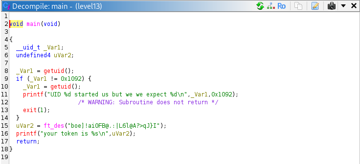
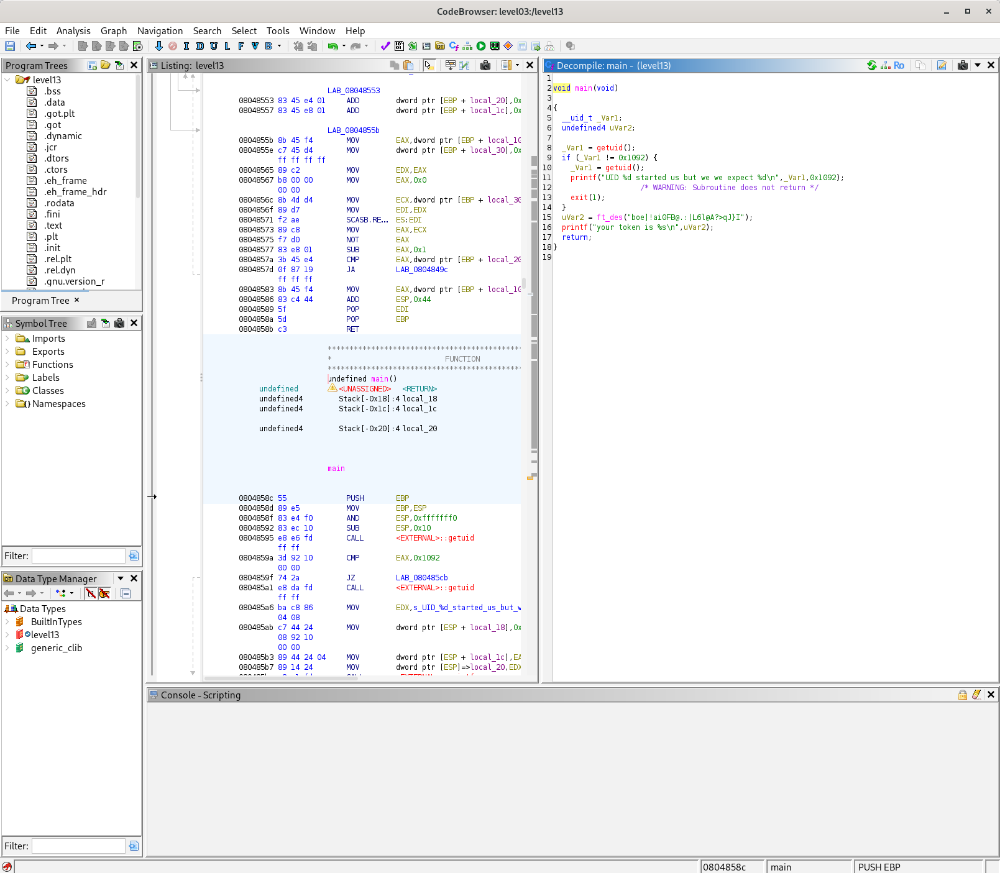

# Level 13 - UID Check Bypass via GDB Register Manipulation

## Overview

The binary for this level refuses to run unless the current user's UID matches `4242` (`0x1092`). Since we cannot change our actual UID, the goal is to intercept execution at runtime using GDB and patch the return value of `getuid()` before the comparison takes place.

```C
void main(void)

{
  __uid_t _Var1;
  undefined4 uVar2;
  
  _Var1 = getuid();
  if (_Var1 != 0x1092) {
    _Var1 = getuid();
    printf("UID %d started us but we we expect %d\n",_Var1,0x1092);
                    /* WARNING: Subroutine does not return */
    exit(1);
  }
  uVar2 = ft_des("boe]!ai0FB@.:|L6l@A?>qJ}I");
  printf("your token is %s\n",uVar2);
  return;
}
```

---

## Source Code Analysis



Decompiling the binary in Ghidra reveals the logic clearly:

```c
_Var1 = getuid();
if (_Var1 != 0x1092) {
    printf("UID %d started us but we we expect %d\n", _Var1, 0x1092);
    exit(1);
}
uVar2 = ft_des("boe]!ai0FB@.:|L6l@A?>qJ}I");
printf("your token is %s\n", uVar2);
```

The binary calls `getuid()`, stores the result, and compares it to `0x1092` (4242 in decimal) — a value that is hardcoded and visible directly in the source. If the UID does not match, the program exits. If it does, it decodes a token using `ft_des` and prints it.

---

## Disassembly Analysis



Running `disassemble main` in GDB confirms what Ghidra showed:

```asm
0x08048595 <+9>:   call   0x8048380 <getuid@plt>   ; calls getuid()
0x0804859a <+14>:  cmp    $0x1092,%eax             ; compares return value to 4242
0x0804859f <+19>:  je     0x80485cb <main+63>       ; jumps to ft_des if equal
0x080485a1 <+21>:  call   0x8048380 <getuid@plt>   ; second call for the error printf
...
0x080485c6 <+58>:  call   0x80483a0 <exit@plt>     ; exits if UID was wrong
0x080485d2 <+70>:  call   0x8048474 <ft_des>       ; decodes and prints the token
```

On x86, the return value of any function is stored in the `eax` register. The `cmp` instruction at `0x0804859a` reads `eax` immediately after `getuid()` returns. This is the exact instruction to target: if we pause execution there and overwrite `eax` before `cmp` runs, the check passes.

---

## Exploitation

```bash
gdb ./level13
```

```gdb
(gdb) disassemble main
# Identify the cmp instruction at 0x0804859a

(gdb) break *0x0804859a
# Set a breakpoint right before the comparison

(gdb) run
# Program pauses at the breakpoint

(gdb) info registers eax
# eax = 2013 (our real UID)

(gdb) set $eax = 0x1092
# Overwrite eax with 4242

(gdb) continue
# Program resumes, check passes, token is printed
```

**Output:**
```
your token is 2A31L79asukciNyi8uppkEuSx
```

---

## Vulnerability

The binary relies on a runtime UID check with no integrity protection. Because the expected value (`0x1092`) is hardcoded and the check happens in user space, any debugger with the ability to pause execution and modify registers can trivially bypass it. A meaningful mitigation would be to perform the check in a privileged context (e.g., a setuid binary calling into a privileged service) where the user cannot attach a debugger.

---

## References

- [GDB Documentation](https://www.gnu.org/software/gdb/documentation/)
- [x86 Calling Convention - OSDev Wiki](https://wiki.osdev.org/Calling_Conventions)
